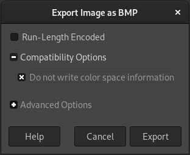

# ScummTR FAQ

## Installation

### Windows tells me that it needs to scan the ScummTR files when I try to use them!

Yes, that's just Windows doing a quick analysis in order to make sure that the program that you've downloaded is safe. Just wait a few seconds, and it will start. This warning should just appear once, for each new ScummTR release.

### When I click on any ScummTR tool, nothing happens

The ScummTR tools require the use of a [command-line interface](https://en.wikipedia.org/wiki/Command-line_interface).

This means that you need experience with the following programs, in order to use ScummTR:

* on Windows: install [Windows Terminal](https://docs.microsoft.com/windows/terminal/get-started) (Windows 10 and later) and start it.
    * On older versions of Windows, hold the Windows and `R` keys together, type `cmd.exe` and hit Enter.
* on macOS: hold the `⌘` and Spacebar keys together, type `Terminal` and hit Enter.
* on other systems: look for a "Terminal" program among your applications.

Once you're inside this Terminal program, type the following commands:

```sh
cd "path/to/the/scummtr/files"
scummtr
```

If you don't understand this, sorry! ScummTR doesn't provide an easier way to use it yet.

### macOS blocks the program, saying that it can't be verified and may be malware!

This a security measure of later macOS versions, because the ScummTR binaries are not signed.

There are two ways to work around this.

1. From the Finder, double-click on the binary you want to use (e.g. `scummfont`), let macOS emit its warning, and then click on Cancel. Now, start the app again, but with a right-click (or `Command` + click), and choose the Open option. The warning prompt will appear again, but this time it will have a new Open button, that you should click on. Repeat this for all the ScummTR binaries you want to use.
2. If you're familiar with the macOS Terminal, run the following command: `xattr -d com.apple.quarantine /path/to/the/scummtr-binary` on each ScummTR binary. You should now be able to start it.

More information: <https://support.apple.com/en-us/HT202491>.

### When I run the macOS binary, I have a "Bad CPU type" error

You may have downloaded an incorrect version for your macOS system.

Two macOS archives are usually provided (except for the earliest ScummTR releases):

* `scummtr-X.X.X-macos.zip`: this is for macOS 10.9 (Mavericks) and newer. The binaries are compatible with Intel 64-bit CPUs and Apple silicon.
* `scummtr-X.X.X-oldmacos.zip`: this is intended for macOS 10.4 (Tiger) until macOS 10.8 (Mountain Lion), although it may also work until Mojave. The binaries are compatible with Intel 32-bit CPUs and PowerPC CPUs. This version has **no 64-bit binaries**.

Try using the binaries from the other archive if you have any problem.

### The MS-DOS binaries give me a "No DPMI" error

The symptom is a `Load error: no DPMI - Get csdpmi*b.zip` message.

You need a [DOS Protected Mode Interface](https://en.wikipedia.org/wiki/DOS_Protected_Mode_Interface) in order to use the MS-DOS binaries. Windows 3.x, 95, 98, ME and NT already have one, but if you use something like DOSBox, you may encounter the error above.

[CWSDPMI](http://sandmann.dotster.com/cwsdpmi/) can be used in this case. Just put the `CWSDPMI.EXE` file next to the ScummTR binaries.

## Usage

### What does each tool do?

* `scummtr`: imports/exports text for SCUMM engine games
    * It's mainly meant for fan translations. Or re-translations. Or typo fixes. Or finding some unknown jokes in the games.
* `scummrp`: packs/unpacks SCUMM game data resources.
    * This lets you dump the *raw* contents of the games. But they're very raw, you'll still need some other tools to decode or transform them. It's only meant for advanced SCUMM users.
* `scummfont`: extracts original SCUMM fonts, and lets you transform them through `.bmp` files.
* `FontXY`: lets you adjust the dimensions of the various *glyphs* inside a SCUMM font, such as the width of a space character in pixels. Almost a typographer's tool!

If you just want to make a translation, `scummtr` (and maybe `scummfont`, if your SCUMM game doesn't provide all the characters for your language) will do 90% of the job.

Note: ScummTR is the name of the project, which has various tools. `scummtr` is the name of the main tool.

### What do all the program options mean?

Please read the [manual pages](man/txt/) for this.

### Which games are supported?

All released Lucasfilm Games (a.k.a. LucasArts) games from *Maniac Mansion* (1987) to *The Dig* (1995) should work. The `scummtr -L` command should give you the complete list.

The main support is for the PC/DOS/Windows variants, though. Some Macintosh/Amiga/Atari/FM-Towns variants may also work, too, but there are much less guarantees for them. Some demo versions may or may not work.

> **Note:** the NES variant of *Maniac Mansion* and the Turbografx/PC Engine variant of *Loom* are known **not** to work, at the moment. The *Passport to Adventure* demo is also mostly unsupported.

Humongous Entertainment games (Putt-Putt, Pajama Sam…) are not supported. *The Curse of Monkey Island* is not supported. *Grim Fandango* and *Escape from Monkey Island* are not SCUMM games, and thus they're not supported.

### Are the remastered editions of the games supported?

No, unless you extract their original content with some of the [Quickandeasysoftware Explorers](https://quickandeasysoftware.net/software).

### Are the Steam versions supported?

For *Sam & Max Hit the Road*, I believe that it should work out of the box, since it appears to rely on ScummVM.

For *Indiana Jones and the Last Crusade*, *Loom*, *Indiana Jones and the Fate of Atlantis* and *The Dig*, the following links may help extract the original resources, but the instructions are a bit rough for non-technical users:

* <https://forums.scummvm.org/viewtopic.php?t=16576>
* <https://github.com/symm/LAAExtract>

(So I'd recommend buying them from GOG, instead.)

For the Monkey Island 1 & 2 games, *Day of the Tentacle* and *Full Throttle*, see the previous section.

There is currently no support for reimporting the resources back into the original Steam executables.

### Are demo versions supported?

Some of them may work, but you may need to rename some files.

For example, the current detection code for Indy4 expects `ATLANTIS.000` files, but the demo files may be named `indydemo.000`, instead. So, in this case, `indydemo.000` needs to be temporarily renamed to `ATLANTIS.000` and `indydemo.001` needs to be temporarily renamed to `ATLANTIS.001`, so that the ScummTR/ScummRP tools can read them.

### Are Humongous Entertainment games supported? (Putt-Put, Freddi Fish, Pajama Sam…)

No. I'm personally not interested in implementing support for them, but contributions are welcome, of course.

I suggest that you look at the [NUTcracker](https://github.com/BLooperZ/nutcracker) project, instead, since there's active work for HE games.

### How do I report a problem with ScummTR, ScummRP, ScummFont or FontXY?

First:

1. Download and make sure that your problem hasn't been solved in [the latest release](https://github.com/dwatteau/scummtr/releases) of the ScummTR tools.
2. Read [this FAQ](FAQ.md) again, in case something could help you there.
3. Explore the [list of current known issues](https://github.com/dwatteau/scummtr/issues) in case someone already reported this problem.

If you still have a problem after following all these steps, then please [create an account on GitHub](https://github.com/signup) and [open a new issue](https://github.com/dwatteau/scummtr/issues/new/choose) with all the information you can give.

> **Note:** any issue regarding illegal copies of the games will be ignored, closed and deleted.

### Is this tool part of ScummVM?

No, but I also make some contributions to ScummVM, from time to time.

### Is this an official tool?

No.

This tool is not affiliated in any way with LucasArts Entertainment Company, or LucasFilm Ltd.

### Are some alternative tools available?

Yes, see the [Alternatives section](README.md#alternatives) of the main README file.

## Troubleshooting

### I've downloaded an FM-Towns version from some “abandonware” website and…

No! We offer zero support for illegal downloads.

Any question, issue, bug report or e-mail about an illegally obtained SCUMM game will be ignored/deleted/closed. Respect Copyright laws.

### When I use some non-Latin characters in my translation, the game won't show them

That's a very common problem when trying to make your own translation of a SCUMM game.

Basically, if your original source in an English version of the game, then the internal fonts will just have the Latin alphabet, and a few extra characters (most of the time).

If you work from a French, German, Italian, Portuguese or Spanish variant, you will have more Western-European characters at your disposal, if this is what you need. People living in the Nordic countries of Europe will probably need to draw some customs characters with `scummfont`, though.

If your language isn't built around Latin letters, this is getting harder, but not impossible. Some communities of SCUMM translators are known to exist for Cyrillic script languages, as well as CJK languages. They may probably help you on their dedicated forums.

> Note that, the SCUMM games mostly coming from the MS-DOS area, they have almost no support for Unicode, and thus the ScummTR tools also have this limitation, at the moment.

### Some really weird characters appear in my translation file for Maniac Mansion or Zak McKracken

The *Maniac Mansion* and *Zak McKracken* games (except the FM-Towns version of Zak) **require** you to give the intended language of the game. Otherwise, non-Latin characters will be incorrectly handled.

The possible `scummtr` options for this are:

* `-c -l en` for English
* `-c -l fr` for French
* `-c -l de` for German
* `-c -l it` for Italian.

If you target some other language, then you'll need to work from one of these versions (non-English versions are recommended, for a larger number of available characters), and modify its font tables with `scummfont` to draw your own characters.

### When a sentence is too long, the game doesn't display it properly

Maniac Mansion, Zak and Indy3 force you to handle the newline placement by yourself, otherwise the text will just be truncated.

For example, in Zak:

```
You don't have the Blue Crystal.\001Come back when you have it.
```

Here, the `\001` sequence will force a newline between the two sentences. You can put a `\001` wherever you would put a space.

Later games try to automatically handle newline placements (as a modern word processor would do), but it may not always suit your needs, especially when dealing with some objects, or when you need to choose a dialogue option from the verb interface.

So, you can still force a newline in the later games when you really need it.

For example, in Indy4:

```
The wrong people\255\001might be waiting for me.
```

i.e. it's the same thing as for Zak, but there you need to use `\255\001` instead of `\001`, because it's a later game.

The main possible sequences for this are:

* `\255\001`: insert a newline character, and go to the next line.
* `\255\002`: once a line has been “told” by a character, it normally disappears from the screen. This sequence forces the game to keep it on the screen until the following line is told too.
* `\255\003`: “clears the page”, i.e. clear the current two lines of dialogue and go back to the first line.

### What does the `^` symbol mean?

It's a shortcurt for a nicer-looking ellipsis sign: `…`.

### What do the `@` symbols mean?

They're used for resource padding.

Sometimes, in a game scene, an object, a verb or an actor may be renamed.

For example, there's Sushi, the fish:

```
Sushi
```

and later on, Sushi can get in a bowl, so you also have:

```
Sushi in a bowl
```

The problem is that the game needs to *reserve* some enough memory to hold all the possible future names of Sushi.

```
Sushi           # <== 5 characters
Sushi in a bowl # <== 15 characters
```

but if `Sushi` is the first name that appears in the game scripts, then `Sushi in a bowl` will never fit! So, the game could crash.

For this, *padding characters* need to be added, so that all the various renames of a particular object/verb/actor have the same, maximal width:

```
Sushi@@@@@@@@@@ # <== 15 characters
Sushi in a bowl # <== 15 characters
```

This is what the `@` characters are about.

If in doubt, you can always add more `@` characters that necessary, as long as the object/actor/verb has the same final length everywhere.

So, in theory, you need to keep track of all the possible object/actor/verb renames that could happen during the game. That's quite tedious, but very fortunately, `scummtr` offers a `-A ao` option that automates this. Search for `-A ao` below for more information.

> **Note:** ScummVM tolerates missing padding symbols, but the original interpreters (such as the original EXE files for MS-DOS) are very sensitive to this, and will very often crash if they're missing.

### `scummtr` gives me an `Empty lines are forbidden` error

This probably means that:

* you've maybe deleted an original sentence from your translation, intentionally or by mistake. You can't use `scummtr` to add or remove some lines from the games. You can just *change* the content of the lines of the game.
   * Your translation file need to have the same number of lines as your source. Restore the missing (or extra) lines from a backup.
* your text editor is maybe doing some things behind your back (such as removing some [whitespace characters](https://en.wikipedia.org/wiki/Whitespace_character)), but `scummtr` expects your text editor to “respect” its original format.
   * Use a text editor which is known not to break the content of the files, such as Microsoft Notepad, Notepad++, Gedit, CotEditor, vim…

<!--
### How do I properly translate the verb interface?

TODO
-->

### What are all these weird `\123\456\789` symbols?

If it starts with the `\254` or `\255` number, then it's probably an internal *escape sequence* of the game. It triggers some special actions, such as a new line, clearing the screen, an actor movement, or some speech. You can change most of the text around these sequences, but **don't** change the sequences themselves.

If it's a lower number, such as `\120`, then it's probably (but not necessarily) a way of representing a character outside of the Latin alphabet, such as an `é`.

### Is it possible to have some non-breaking spaces, for better typography?

Yes, but as far as I know, only Indy4 had some “official” support for this.

Fortunately, it's possible to replicate this in some other games. I will write a guide about this at some point, but if you need this information in the meantime, feel free to contact me.

### How do I extract a Japanese game?

ScummTR 0.5.0 added a `-r` option to make this (a bit) easier.

For example, with the Japanese FM-TOWNS version of Indy4, use this command:

```sh
scummtr -g atlantis -rw -of atlantis-japanese.txt
```

The resulting `atlantis-japanese.txt` file will then use the original encoding of the game, which is, in this case, [Shift JIS](https://en.wikipedia.org/wiki/Shift_JIS). Because of this, your text editor will needs proper support for this encoding.

> **Note:** the Shift JIS encoding replaces backslash characters (`\`) with yen signs (`¥`), so all SCUMM escape sequences will appear with a yen sign, instead. This is an inherent behavior of this encoding, and can't really be worked around.

### How do I use Unicode characters?

At the moment, you just can't. Most SCUMM games predate common Unicode usage, and rely on [DOS code pages](https://en.wikipedia.org/wiki/Code_page#DOS_code_pages), most of the time.

Moreover, a glyph will only appear in a SCUMM game if it's part of the included SCUMM fonts.

### My savegames crash, when I translate my game scene by scene

Yes, the SCUMM savegames embed the names of the various objects/verbs/actors that you've encountered, so if you've translated/renamed them after they appeared in a savegame, then the game will get lost and crash when you load it back. You need to start the game from scratch, over and over, while translating it.

This is quite tedious, indeed, but fortunately, the SCUMM games also provide some Boot Params which let you “teleport” to any scene at any time. Read the [ScummVM documentation about Boot Params](https://wiki.scummvm.org/index.php/Boot_Params) to learn more about this.

### Maniac Mansion starts in demo mode after modifying it with ScummTR!

Yes, ScummTR and ScummRP have problems with the “V2” version of Maniac Mansion.

The “V1” version of the game appears to be OK, though.

### I see `Bad data was found and ignored` messages, is anything wrong?

This may happen with some games, because of original error in the official game resources, or because of a bug on our side.

For example, the FM-TOWNS of Zak McKracken (as sold by GOG) will output this warning:

```
WARNING: Bad data was found and ignored at 0x6 in 47.LFL
```

As long as it's printed as a `WARNING` (and not as an `ERROR`), and as long as the game appears to play fine even after modifying it, then you can probably ignore this.

However, this kind of warnings can also hint at a possible game corruption, or a bug. Please [open an issue](https://github.com/dwatteau/scummtr/issues) if you're stuck.

### When I extract the text from The Dig, I get English text although my game is not in English

It appears that *The Dig* contains both the original text and its translation, and that ScummTR only deals with the former.

Thus, for now, it is recommended to work from a real original English version of the game.

### My game works fine in ScummVM, but crashes in an original interpreter (such as DOSBox)

First, make sure that the game wasn't already crashing before you modified it (you're maybe missing some files that ScummVM didn't require but that DOSBox needs).

If your error really only appears with your translation, did the game give an error message similar to `new name of object 127 too long`?

If that's the case, then forcing some extra padding (with the `-A ao` option) may just fix the problem, as long as you re-export/re-import your translation with it:

```sh
scummtr -g monkey2 -cw -A ao -of translation-with-added-padding.txt
scummtr -g monkey2 -cw -A ao -if translation-with-added-padding.txt
```

If if still crashes, then maybe something corrupted the game somehow (such as some invalid characters or an invalid font). Please note any error message, [open an issue](https://github.com/dwatteau/scummtr/issues) and give as much context as you can. Thanks.

### I'm on Linux, I do have the various `000.lfl` files, but `scummtr`/`scummrp` won't see them

The ScummTR tools currently expect all-uppercase files, that is, you need to have `.LFL` files, and not `.lfl` files (same thing applies to `.LEC` files, `MONKEY2.000` files, and so on).

Linux filesystems are case-sensitive by default, and the ScummTR tools don't do a case-insensitive lookup yet. So you have to rename your local files.

### ScummFont rejects every BMP file that I give to it

Currently, ScummFont expects your image editor to preserve all the settings of the original BMP file.

The problem is that most modern BMP editors *do* change some settings, but ScummFont doesn't handle this, which means that your game could get corrupted. In order to avoid this, ScummFont 0.5.0 tries to detect and reject any BMP that doesn't meet its strict requirements.

(ScummFont should actually use a better format, or have a better BMP implementation, but this means that most of ScummFont should be rewritten, and this isn't going to happen for now.)

If you're looking for a compatible image editor, you can try editing the original BMP file with:

* The [GIMP image editor](https://www.gimp.org), as long as you export it as BMP with the "Do not write color space information" compatibility option,
* or an older version of Microsoft Paint (such as the one from Windows XP or earlier).



### There was a bug in one of the ScummTR tools, and it corrupted my original game / I lost many hours of work!!

Sorry! But this is free software, [*without warranty of any kind*](COPYING). Please file a [bug report](https://github.com/dwatteau/scummtr/issues), and always make regular backups of the stuff you care about!

## Compilation

### Compiling ScummTR for my system doesn't work

Make sure that you have:

* a Windows or [POSIX](https://en.wikipedia.org/wiki/POSIX#POSIX-oriented_operating_systems) system
* a C++98 compiler (such as g++, clang++, or [Mingw-w64](https://www.mingw-w64.org) or MSVC 2015 or later for Windows)
* [CMake](https://cmake.org).

Then, read the [release documentation](releases/README.md) for more information.

Alternatively, just use a [pre-built binary](https://github.com/dwatteau/scummtr/releases) for your system, if it exists. This is recommended.
